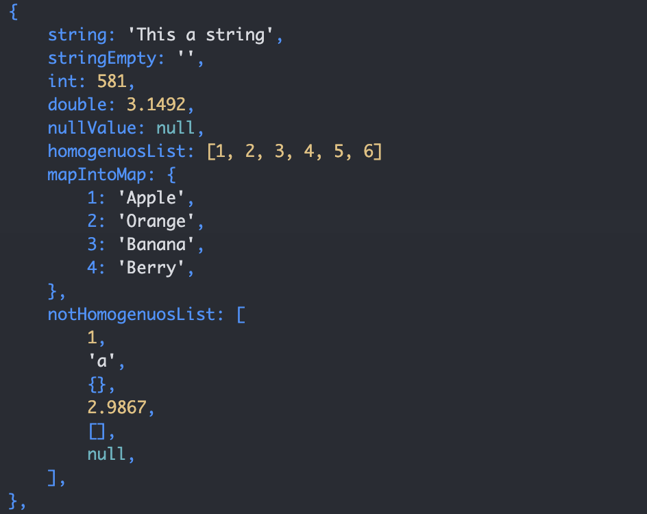

## PrintMap 

 
 
 

Es un package creado con la intención de facilitar la lectura de datos de tipo ```Map<dynamic,dyanmic>``` que obtengamos como respuesta de alguna *API* o necesitamos visualizar un *DTO, Modelo u Entidad*. 

Un claro ejemplo es a la hora de imprimir un Map utilizando ```print()```, 

tenemos el siguiente "JSON" que creamos con fines didácticos. 

``` 
final json = {
    'string': 'This a string',
    'stringEmpty': '',
    'int': 581,
    'double': 3.1492,
    'nullValue': null,
    'homogenuosList': [1, 2, 3, 4, 5, 6],
    'mapIntoMap': {
    1: 'Apple',
    2: 'Orange',
    3: 'Banana',
    4: 'Berry',
    },
    'notHomogenuosList': [
    1,
    'a',
    {},
    2.9867,
    [],
    null,
    ],
};

``` 

> la salida normal obtenida por el ```print(json)``` seria la siguiente: 


``` 

{string: This a string, stringEmpty: , int: 581, double: 3.1492, nullValue: null, homogenuosList: [1, 2, 3, 4, 5, 6], mapIntoMap: {1: Apple, 2: Orange, 3: Banana, 4: Berry}, notHomogenuosList: [1, a, {}, 2.9867, [], null]} 

``` 

> En cambio utilizado este package la salida seria la siguiente 

 

## Ventajas 

Hay una notable mejora en la representación de los objetos, facilitando así su rápida lectura y disminuyendo el tiempo que pasamos leyendo un objeto. además de que si la lista tiene datos homogéneos es representada de una forma a que si todos sus datos son diferentes como podemos apreciar en la salida `homogenuosList` y `notHomogenuosList`, mostrando un color de impresión dependiendo del tipo de objeto, así mismo pudiendo imprimir objetos anidados como mapas o listas dentro de otros mapas o listas 


`String` 

- Si están vacíos se representan con dos comillas simples. 

- Se representan con color blanco. 


`Int o Double` 

- Se representan con un color amarillo 


`null` 

- Se representan con un color verdoso 


## Desventajas 

**1. ninguna.** 

## NO USAR `i` 

El package recibe como parámetro opcional `i= 0`, esto es así porque se utiliza recursividad, no usar el parámetro, simplemente llamar a la función `printMap(json)` y es todo. 

 